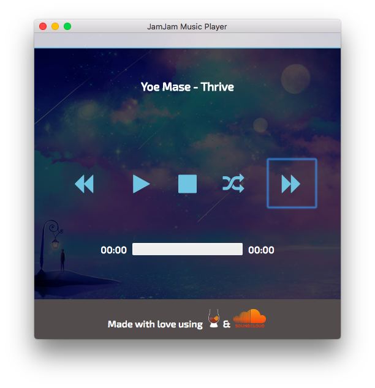

# JamJam Music Player

**What It Is**

Just a minimal and simple music player made using [React](https://facebook.github.io/react/), [Babel](https://babeljs.io), [Browserify](http://browserify.org), [Electron](http://electron.atom.io) and Node. I made it for fun and for learning React.



## To Use

To clone and run this repository you'll need [Git](https://git-scm.com) and [Node.js](https://nodejs.org/en/download/) (which comes with [npm](http://npmjs.com)) installed on your computer. From your command line:

```bash
# Clone this repository
git clone https://github.com/Cherubyx/JamJam
# Go into the repository
cd JamJam
# Install dependencies and run the app
npm install && npm start
```

#### License [MIT](LICENSE)
